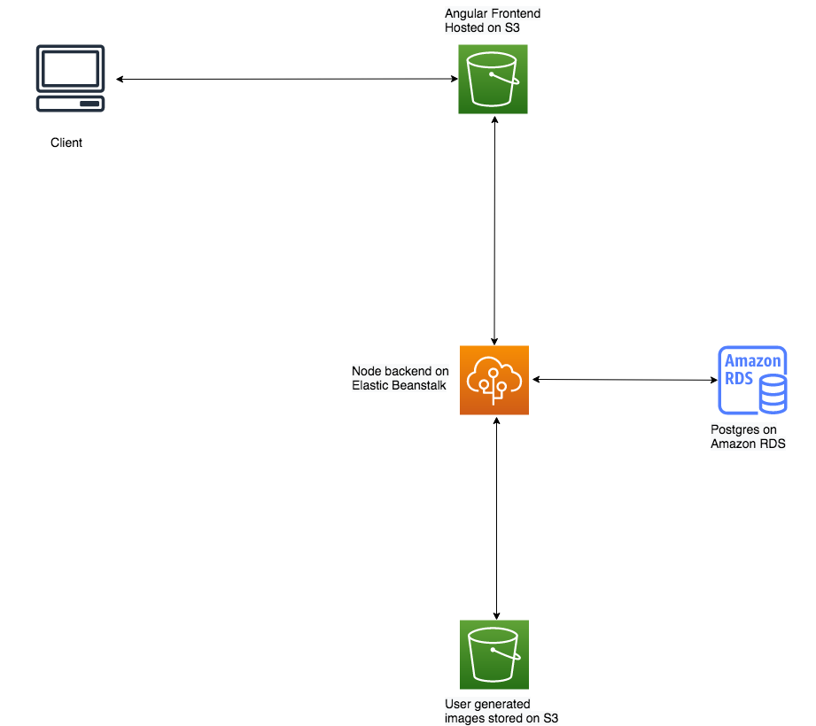

# Infrastructure

This **full stack application** is hosted on **AWS** and uses **EBS**, **RDS** and **S3**

## Services Used

- RDS:
  Publicly accessible ``PostgreSQL`` database
- S3 Bucket:
  For Angular frontend
  For images uploaded by the users
- Elastic Beanstalk:
  For hosting the backend

