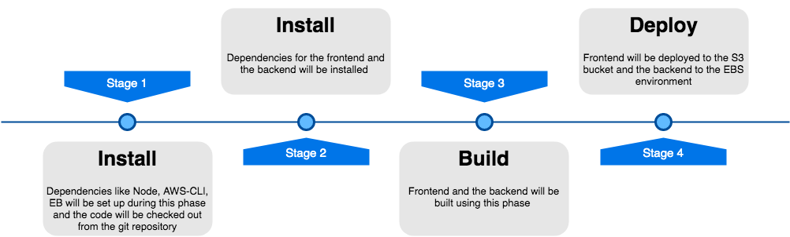

# Pipeline

CircleCI is being used for CI/CD

## Sequence

1. Install dependencies (Node, AWS-CLI, Eb) and checkout code from the github repository
2. Install frontend and backend
3. Build frontend and backend
4. Deploy frontend and backend

